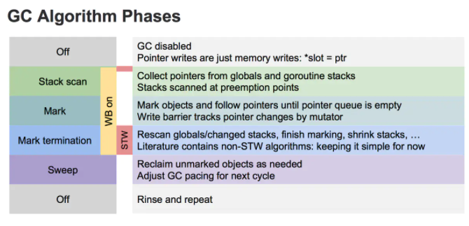
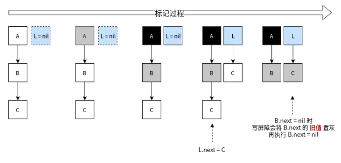

- 标记清除
- 并行标记清除
- 三色标记法
- Hybrid Write Barrier

<!-- more -->

- [标记清除 & 并行标记清除](#标记清除--并行标记清除)
- [三色标记法](#三色标记法)
- [Hybrid Write Barrier (混合写屏障)](#hybrid-write-barrier-混合写屏障)
- [何时触发 GC](#何时触发-gc)
- [其他优化](#其他优化)
- [展望](#展望)
- [结论](#结论)
- [参考链接](#参考链接)

## 标记清除 & 并行标记清除

GC 开始之后, 启动 STW 然后从 root 开始,  root 区值当前所有 goroutine 的栈和全局数据区的变量(主要是这 2 个地方), 将能被触及的 object 标记, 剩下的就是可回收的; 最后再清理放回 mcache 中, 以备后续使用.

并行标记清除, 实际上是清理过程不需要 STW, 减少了 STW 的时间.

## 三色标记法

1. 正常情况下，写操作就是正常的赋值。
2. GC 开始，开启写屏障等准备工作。开启写屏障等准备工作需要短暂的 STW。
3. Stack scan 阶段，从全局空间和 goroutine 栈空间上收集变量。
4. Mark 阶段，执行上述的三色标记法，直到没有灰色对象。
5. Mark termination 阶段，开启 STW，回头重新扫描 root 区域新变量，对他们进行标记。
6. Sweep 阶段，关闭 STW 和 写屏障，对白色对象进行清除。

## Hybrid Write Barrier (混合写屏障)

Go 在 1.8 版本引入了混合写屏障，其会在赋值前，对旧数据置灰，再视情况对新值进行置灰。

## 何时触发 GC

- 容量触发 - 达到设置的阈值触发 GC, 默认为100(即内存增长100%即触发一次), 可以通过环境变量 GOGC 或者 debug.SetGCPercent()
- 时间触发 - 每隔 2 分钟, 触发一次 GC
- 手动触发 - runtime.GC()

## 其他优化

- 只会占用 25% 的 cpu 算力处理 GC 逻辑, 保证减少对用户的影响. 若下一轮 GC 触发, 会等待上一轮执行完毕
- 对于 tiny 对象, 直接标记黑色, 没有灰色阶段, 因为不存在引用对象
- 采用对象池的方式, 减少 GC 的压力, 但实际上也会存在标记的压力; 如果可以放在永久标记, 就可以减少标记压力
- 直接申请大内存(大于32k), 对 GC 来说是一个 largespan; 需要自行代码管理

## 展望

1. 引入分代机制, 像 JVM 那样内存分为 一级/二级/永久, 不同级别, 采用不同的计算资源

## 结论

1. 减少层级数 - 嵌套层级越多, 对于 GC 的压力越大; 如: chan map[string][]*string

## 参考链接

- [吴戴均-Golang GC核心要点和度量方法](https://wudaijun.com/2020/01/go-gc-keypoint-and-monitor/)
- [吴戴均-常见GC算法及Golang GC](https://wudaijun.com/2017/12/gc-study/)
- [达菲格-Go 语言内存管理（四）](https://www.jianshu.com/p/0083a90a8f7e)