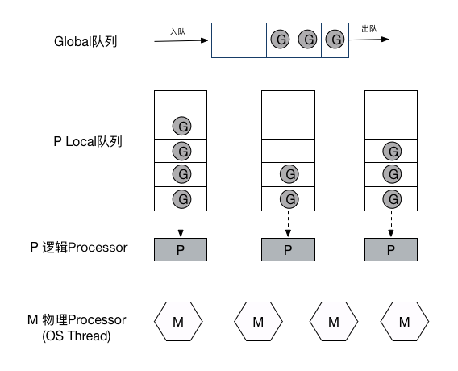

熟悉 Golang 的调度原理, 能够帮助编写更加高效的并发逻辑; 同时还能避免调度相关的坑.

<!-- more -->

- [GPM 模型](#gpm-模型)
- [调度流程](#调度流程)
- [用户方式阻塞/唤醒](#用户方式阻塞唤醒)
- [syscall](#syscall)
- [sysmon](#sysmon)
- [抢占式调度](#抢占式调度)
- [netpoll](#netpoll)
- [g 的创建流程](#g-的创建流程)
- [g 的暂停方式](#g-的暂停方式)
- [Go 调度查看方式](#go-调度查看方式)
- [总结](#总结)
- [参考链接](#参考链接)

## GPM 模型

文件位置: src/runtime/runtime2.go

- g(goroutine): 对应到 g 结构体, 保存 goroutin 需要的堆栈信息
- p(process):   相当于 g 的驱动, 只有绑定在 local runq 下, 才能被调度
- m(machine):   OS 线程抽象, 真正的驱动力, 和某个 p 绑定, 然后 p 从 local runq 中依次取出 g 用来执行

补充:

1. 最早 go1.1 仅仅是 GM 模式, 后续 Dmitry Vyukov 为了解决**并发伸缩性**问题, 引入 p 的概念 [提案文档](../pdf/Scalable%20Go%20Scheduler%20Design%20Doc.pdf)
2. g 的数量受限于 GOMAXPROCS, 即超线程数量, 一般 intel cpu 具有超线程技术, 双核四线程, 即数量为4
3. m 的个数是不定的，由Go Runtime调整，默认最大限制为10000个

## 调度流程

1. m 与 p 绑定, m 从 p 的 local runq 中取出并切换到 g 的堆栈执行
   1. 若 local runq 存在 g, 则执行(无锁)
   2. 若不存在, 从 global runq 取出 g 执行(有锁)
   3. 若依然不存在, 则从其他 p "窃取" g 执行
2. 若没有 g 可以执行, 则 m 与 p 解绑, 进入休眠模式(idle)

## 用户方式阻塞/唤醒

阻塞:

当 g 被 channel 卡住, m 会跳过执行下一个, 并将 g 放置在 waitq 里面

唤醒:

当 g 执行的时候, 通过 channel 向另一个 g2 投递消息, 则 g2 将直接"插队", 放下一个执行

## syscall

若 g 被阻塞在一个系统调用上, 则 p 将于 m 解绑, 寻找 idle 状态的 m 再此绑定; 若没有 idle 状态的 m, 则创建一个新的 m.

系统调用结束, g 会重新寻找 idle 状态的 p, 并恢复执行, 若没有则放到 globl runq 中.

系统被调度的两个关键点:

1. runtime/syscall包中, 系统调用分为 syscall & rawsyscall, 区别在于前者会记录保存和恢复所需状态, 这样可以安全的解绑; 某些系统调用可以预先评估是会长时间阻塞, 则会发起之前, 直接 p & m 解绑(handoffp)
2. sysmon 负责检查系统调用时间, 决定是否需要 handoffp

## sysmon

sysmon 是一个由 runtime 启动的M，也叫监控线程，它无需P也可以运行，它每20us~10ms唤醒一次.

流程如下:

1. 释放闲置超过5分钟的span物理内存；
2. 如果超过2分钟没有垃圾回收，强制执行；
3. 将长时间未处理的netpoll结果添加到任务队列；
4. 向长时间运行的G任务发出抢占调度；
5. 收回因syscall长时间阻塞的P；

## 抢占式调度

当某个 g 执行超过10ms, 则 sysmon 将发起抢占式请求, 会给 g 打上标签; 当 g 执行函数时(更确切说，在通过newstack分配函数栈时), 将被 runtime.Goched 的方式暂停, 放置在 global runq 中

## netpoll

除了之前提到的, local runq, runqnext, global runq, 还存在对网络 I/O 进行优化的 netpoll, 本地避免网络I/O的时候陷入系统调用, 不阻塞 M (而是阻塞 G ), 从而不会导致大量的 M 被创建

## g 的创建流程

1. 当 go func(){} 执行的时候, 会尝试从池子中复用, 没有则创建
2. 尝试"插队", 放置到当前 p 的 runnext 里面
3. 否则放置到 local runq 中(无锁)
4. 否则放置到 global runq 中(有锁)

## g 的暂停方式

- 常规方式  - 将 g 阻塞, 放到 global runq 中, 等待被获取执行
- 等待方式  - 将 g 阻塞, 放到 waitq 中, 等待被其他 g 唤醒
- 自旋方式  - gpm 都不调度, 直到被唤醒
- 退出方式  - 立即终止 g 任务, 确保 defer 正常执行
- process 方式 - 放飞 p, 阻塞 g m, p 可以跟其他 m 绑定

## Go 调度查看方式

- [吴戴均-Go 调度模型](https://wudaijun.com/2018/01/go-scheduler/)

## 总结

从调度模型, 到 gpm 的探讨, 讲到了阻塞和唤醒的流程, 以及如何抢占, 延伸到 sysmon 服务的特点; 最后补充了 netpoll 优化和 g 的创建流程和状态介绍.
回过头来, 我们再看看, 学习调度的目的其实实际需求来讲, 就是编写更加高效的并发程序, 明白了流程, 还需要实战, 后续再更新代码实战的情况.

## 参考链接

- [吴戴均-Go 调度模型](https://wudaijun.com/2018/01/go-scheduler/)
- [吴戴均-再谈调度](https://wudaijun.com/2018/11/scheduler-blabla/)
- [达菲格-Go 语言调度（一）: 系统调度](https://www.jianshu.com/p/db0aea4d60ed)
- [达菲格-Go 语言调度（二）: goroutine 调度器](https://www.jianshu.com/p/cb6881a2661d)
- [达菲格-Go 语言调度（三）: 并发](https://www.jianshu.com/p/ef654413f2c1)